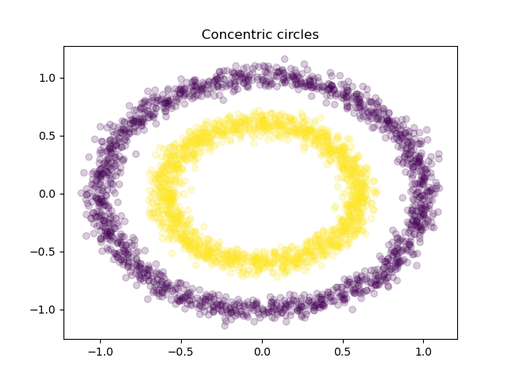
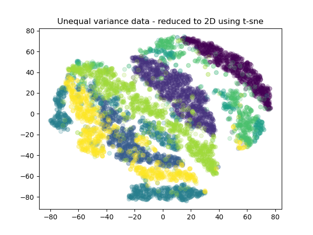

# Datasets for Clustering Base category on Ready Tensor

This repo contains all files related to the datasets used in algorithm evaluation for the Clustering - Base category.

The `datasets` folder contains the main data files and the schema files for all the benchmark datasets under Clustering - Base category. Within each dataset folder in `datasets`:

- The `raw` folder contains the original data files from the source (see attributions below).
- `processed` folder contains the processed files. These files are used in algorithm evaluations.
  - The CSV file with name "<dataset_name>.csv" is the main data used for the clustering analysis.
  - "\_test_key.csv" contains the known targets for the data. These targets are used for extrinsic validation using metrics such as purity and adjusted mutual information.
  - The JSON file with suffix "\_schema.json" is the schema file for the corresponding dataset.
  - The JSON file with the suffix "\_infer*req.json" contains a sample JSON object with the data to make an inference request to the \_optional* /infer endpoint.
- The Jupyter notebook file within each dataset folder is used to convert the raw data file(s) in `raw` folder into the processed form in `processed` folder.
- The folder `schema_cfg` contains a csv which is needed by the schema generation script (described below) .

`schema_gen` folder contains a schema gen config file (YAML) and a python script which are used to generate the JSON schema files stored in the `processed` folder for each dataset. The generated schema file conforms to the Ready Tensor specification for this category.

---

The following is the list of datasets along with a brief description for each and its attribution:

---

## Concentric Circles

#### Alias (in scorecards): concentric_circles

#### Domain / Industry: None (synthetic data) 

#### Description

This dataset is synthetically generated. Two clusters are created which are concentric circles (bands) with some Gaussian noise. The goal is to present data with non-Gaussian clusters and that is not linearly separable. See generated data:

#### Dataset characteristics

- Number of samples = 3,000
- Number of input features = 2
- Number of known clusters = 2

#### Attribution

Synthetically generated data

---

## Gesture Phase Segmentation

#### Alias (in scorecards): gesture_phase2

#### Domain / Industry: Biomechanics / Biosciences

#### Description

Dataset consists of features extracted from 7 videos with people gesticulating, aiming at studying Gesture Phase Segmentation. Features define the velocity and acceleration of hands and wrists. The gestures are classified into one of 5 categories: D (rest position, from portuguese “descanso”), P (preparation), S (stroke), H (hold), R (retraction).

#### Dataset characteristics

- Number of samples = 9,900
- Number of input features = 32
- Number of known clusters = 5

#### Attribution

Original source of data (multiple papers):

Madeo, R. C. B. ; Lima, C. A. M. ; PERES, S. M. . Gesture Unit Segmentation using Support Vector Machines: Segmenting Gestures from Rest Positions. In: Symposium on Applied Computing (SAC), 2013, Coimbra. Proceedings of the 28th Annual
ACM Symposium on Applied Computing (SAC), 2013. p. 46-52.

Wagner, P. K. ; PERES, S. M. ; Madeo, R. C. B. ; Lima, C. A. M. ; Freitas, F. A. . Gesture Unit Segmentation Using Spatial-Temporal Information and Machine Learning. In: 27th Florida Artificial Intelligence Research Society Conference (FLAIRS), 2014, Pensacola Beach. Proceedings of the 27th Florida Artificial Intelligence Research Society Conference (FLAIRS). Palo Alto : The AAAI Press, 2014. p. 101-106.

Creators: Renata Cristina Barros Madeo (Madeo, R. C. B.) Priscilla Koch Wagner (Wagner, P. K.) Sarajane Marques Peres (Peres, S. M.) {renata.si, priscilla.wagner, sarajane} at -A Home 04-06-2020 Dr. Sarajane M. Peres

Dataset can be found here:
https://archive.ics.uci.edu/ml/datasets/gesture+phase+segmentation#

UCI Machine Learning Repository [http://archive.ics.uci.edu/ml]. Irvine, CA: University of California, School of Information and Computer Science.

---

## Iris

#### Alias (in scorecards): iris

#### Domain / Industry: Biosciences

#### Description

This is the popular iris dataset used in academic courses related to clustering and pattern recognotion.

The data set contains 3 classes of 50 instances each, where each class refers to a type of iris plant. One class is linearly separable from the other 2; the latter are NOT linearly separable from each other.

#### Dataset characteristics

- Number of samples = 150
- Number of input features = 4
- Number of known clusters = 3

#### Attribution

Source:

Fisher,R.A. "The use of multiple measurements in taxonomic problems" Annual Eugenics, 7, Part II, 179-188 (1936); also in "Contributions to Mathematical Statistics" (John Wiley, NY, 1950).

Creator:
R.A. Fisher

Donor:
Michael Marshall (MARSHALL%PLU '@' io.arc.nasa.gov)

Dataset can be found here:
https://archive.ics.uci.edu/ml/datasets/iris

UCI Machine Learning Repository [http://archive.ics.uci.edu/ml]. Irvine, CA: University of California, School of Information and Computer Science.

---

## Landsat Satellite

#### Alias (in scorecards): landsat_satellite2

#### Domain / Industry: Space / Geospatial Technology

#### Description

The database consists of the multi-spectral values of pixels in 3x3 neighbourhoods in a satellite image, and the classification associated with the central pixel in each neighbourhood. The aim is to predict this classification, given the multi-spectral values. In the sample database, the class of a pixel is coded as a number.

#### Dataset characteristics

- Number of samples = 6,435
- Number of input features = 36
- Number of known clusters = 6

#### Attribution

Source:

Ashwin Srinivasan
Department of Statistics and Data Modeling
University of Strathclyde
Glasgow
Scotland
UK
ross '@' uk.ac.turing

The original Landsat data for this database was generated from data purchased from NASA by the Australian Centre for Remote Sensing, and used for research at:
The Centre for Remote Sensing
University of New South Wales
Kensington, PO Box 1
NSW 2033
Australia.

Dataset can be found here:
http://archive.ics.uci.edu/ml/datasets/Statlog+(Landsat+Satellite)

UCI Machine Learning Repository [http://archive.ics.uci.edu/ml]. Irvine, CA: University of California, School of Information and Computer Science.

---

## Page Blocks Classification

#### Alias (in scorecards): page_blocks2

#### Domain / Industry: Information / Digital Media

#### Description

The problem consists in classifying all the blocks of the page layout of a document that has been detected by a segmentation process. This is an essential step in document analysis in order to separate text from graphic areas. Indeed, the five classes are: text (1), horizontal line (2), picture (3), vertical line (4) and graphic (5).

The inputs used for classification of each block include features such as block height, length, area, eccentricity, mean number of white-black transitions, etc.

#### Dataset characteristics

- Number of samples = 5,473
- Number of input features = 11
- Number of known clusters = 5

#### Attribution

Creator:
Donato Malerba Dipartimento di Informatica University of Bari via Orabona 4 70126 Bari - Italy phone: +39 - 80 - 5443269 fax: +39 - 80 - 5443196 malerbad@vm.csata.it

Donor:
Donato Malerba (c) Date: July 1995

Dataset can be found here:
https://www.openml.org/d/30

---

## Penguins

#### Alias (in scorecards): penguins

#### Domain / Industry: Biosciences

#### Description

This is a dataset provided by palmerpenguins which contains combined data for 3 penguin specifies. It is a great alternative dataset to the frequently used iris dataset.

#### Dataset characteristics

- Number of samples = 342
- Number of input features = 4
- Number of known clusters = 3

#### Attribution

Source:

Gorman KB, Williams TD, Fraser WR (2014) Ecological Sexual Dimorphism and Environmental Variability within a Community of Antarctic Penguins (Genus Pygoscelis). PLoS ONE 9(3): e90081. doi:10.1371/journal.pone.0090081

Dataset can be found here:
https://allisonhorst.github.io/palmerpenguins/

---

## Spambase

#### Alias (in scorecards): spam2

#### Domain / Industry: Technology / Internet Services

#### Description

This dataset contains collection of spam and non-spam emails converted to numerical features. Spam e-mails came from postmaster and individuals who had filed spam.Non-spam e-mails came from filed work and personal e-mails, and hence the word 'george' and the area code '650' are indicators of non-spam. These are useful when constructing a personalized spam filter. One would either have to blind such non-spam indicators or get a very wide collection of non-spam to generate a general purpose spam filter.

#### Dataset characteristics

- Number of samples = 4,601
- Number of input features = 57
- Number of known clusters = 2

#### Attribution

Creators:
Mark Hopkins, Erik Reeber, George Forman, Jaap Suermondt
Hewlett-Packard Labs, 1501 Page Mill Rd., Palo Alto, CA 94304

Dataset can be found here:
UCI Machine Learning Repository: Spambase Data Set
UCI Machine Learning Repository [http://archive.ics.uci.edu/ml]. Irvine, CA: University of California, School of Information and Computer Science.

---

## Steel Plate Fault

#### Alias (in scorecards): steel_plate_fault2

#### Domain / Industry: Steelmaking / Steel

#### Description

A dataset of steel plates faults, classified into 7 different types. The goal is to train machine learning for automatic pattern recognition.

#### Dataset characteristics

- Number of samples = 1,941
- Number of input features = 27
- Number of known clusters = 7

#### Attribution

Source:

Semeion, Research Center of Sciences of Communication, Via Sersale 117, 00128, Rome, Italy.
www.semeion.it

Dataset can be found here:
http://archive.ics.uci.edu/ml/datasets/steel+plates+faults

UCI Machine Learning Repository [http://archive.ics.uci.edu/ml]. Irvine, CA: University of California, School of Information and Computer Science.

---

## Unequal Variance Blobs

#### Alias (in scorecards): unequal_variance_blobs

#### Domain / Industry: None (synthetic data)

#### Description

This dataset is synthetically generated. Eight Gaussian clusters are created with unequal variances and sample sizes per cluster. See generated data, reduced to 2D using T-SNE for visualization:

#### Dataset characteristics

- Number of samples = 8,067
- Number of input features = 8
- Number of known clusters = 8

#### Attribution

Synthetically generated data

---

## Vehicle Silhouettes

#### Alias (in scorecards): vehicle_silhouettes2

#### Domain / Industry: Automotive

#### Description

The purpose is to classify a given silhouette as one of four types of vehicle, using a set of features extracted from the silhouette. The vehicle may be viewed from one of many different angles.

Four "Corgie" model vehicles were used for the experiment: a double decker bus, Cheverolet van, Saab 9000 and an Opel Manta 400. This particular combination of vehicles was chosen with the expectation that the bus, van and either one of the cars would be readily distinguishable, but it would be more difficult to distinguish between the cars.

The features were extracted from the silhouettes by the HIPS (Hierarchical Image Processing System) extension BINATTS, which extracts a combination of scale independent features utilising both classical moments based measures such as scaled variance, skewness and kurtosis about the major/minor axes and heuristic measures such as hollows, circularity, rectangularity and compactness.

The original purpose of the study was to find a method of distinguishing 3D objects within a 2D image by application of an ensemble of shape feature extractors to the 2D silhouettes of the objects. Measures of shape features extracted from example silhouettes of objects to be discriminated were used to generate a classification rule tree by means of computer induction.

#### Dataset characteristics

- Number of samples = 1,846
- Number of input features = 18
- Number of known clusters = 4

#### Attribution

Data comes from this study:
Siebert,JP. Turing Institute Research Memorandum TIRM-87-018 "Vehicle Recognition Using Rule Based Methods" (March 1987).

Source:

Drs.Pete Mowforth and Barry Shepherd
Turing Institute
George House
36 North Hanover St.
Glasgow
G1 2AD

Dataset can be found here:
https://archive.ics.uci.edu/ml/datasets/Statlog+(Vehicle+Silhouettes)

UCI Machine Learning Repository [http://archive.ics.uci.edu/ml]. Irvine, CA: University of California, School of Information and Computer Science.

---
